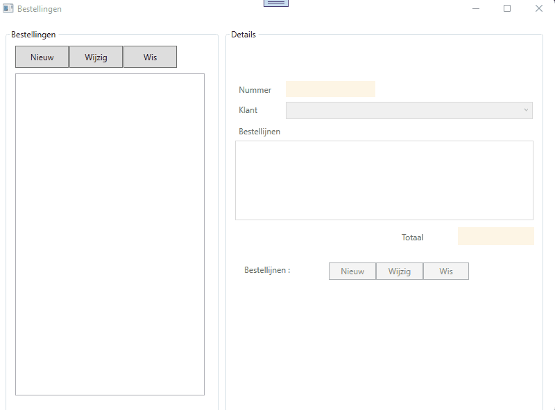

# Herhalingsoefening klassen en objecten : BESTELLINGEN  

## Demo

## De bedoeling  

De bedoeling van deze applicatie is duidelijk : we maken een programma waarin we bestellingen kunnen beheren.  
We zullen er voor zorgen dat bij opstart een lijst met klanten en een lijst met artikels ter beschikking staat (via seeding).  
Via het programma kunnen we nieuwe bestellingen toevoegen, bestellingen wijzigen of bestaande bestellingen verwijderen.  

Een bestelling zelf heeft een nummer, een datum en een klant.  Het nummer moet automatisch toegekend worden door ons systeem.  De datum zal steeds de huidige datum zijn.
We laten niet toe dat een bestelling toegevoegd of gewijzigd wordt ZONDER klant.  
We laten evenmin toe dat we een bestelling toevoegen of wijzigen zonder detaillijnen (zie hieronder).  

Per bestelling kunnen 1 of meerdere bestellijnen bijgehouden worden.  
Elke bestellijn bestaat uit een artikel en het bestelde aantal.
We laten niet toe dat er bestellijnen toegevoegd worden zonder artikel en waarvan het aantal (kleiner of) gelijk is aan 0.  

## Technisch 
Uiteraard gaan we aan de slag met klassen.  
We maken volgende ENTITEITSKLASSEN aan : 
  * **Artikel**  
    * Eigenschappen  
      * ArtikelNummer, string
      * ArtikelOmschrijving, string
      * Verpakking, string
      * Prijs, decimal  
    * Constructor :  voorzie 1 constructor die alle waarden voor de 4 eigenschappen ontvangt.  
    * Override ToString : zie demo  
  * **Klant**  
    * Eigenschappen  
      * Naam, string
      * Adres, string
      * Gemeente, string
      * Land, string 
    * Constructor :  voorzie 1 constructor die alle waarden voor de 4 eigenschappen ontvangt.  
    * Override ToString : zie demo  
  * **Bestelling**  (deze entiteitsklasse voorziet ten dele in een service : bestellijnen toevoegen en verwijderen)  
    * Eigenschappen 
      * Nummer, int
      * Klant, **Klant**
      * Datum, DateTime
      * Bestellijnen, List<**Bestellijn**>   
    * Constructor : voorzie 1 constructor die er voor zorgt dat de datum toegekend wordt en dat de prop Bestellijnen geïnstantieerd wordt.  
    * Override ToString : zie demo
    * Voorzie een methode **BestellijnToevoegen** die een **Artikel** object en een **Aantal** (int) ontvangt.  Deze methode maakt een nieuwe **Bestellijn** object aan en voegt deze toe aan de eigenschap **Bestellijnen**.
    * Voorzie een methode **BestellijnVerwijderen** dat een **Bestellijn** object ontvangt en dit object verwijdert uit de eigenschap **Bestellijnen**.  
  * **Bestellijn**  
    * Eigenschappen   
      * Artikel, **Artikel**  
      * Aantal, int  
    * Constructor : voorzie 1 constructor die alle waarden voor de 2 eigenschappen ontvangt.  
    * Override ToString : zie demo  

